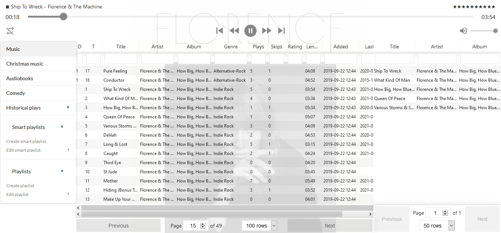

# Music Client
Music client is an unoriginally named React app that integrates with [my music API](https://github.com/StevenMassaro/music). It supports two different methods of installation: purely remote, where files are streamed from the music API, or `local` where a copy of the music files are stored on the machine hosting the music client.

## Architecture
The unique design of allowing both remote and local usage of the client demands a more complicated architecture.

In both remote and local mode, two Spring Boot backends are running in the docker image to support the application.

The `music-client-ui` projects utilizes Spring Boot (to provide a subset of the endpoints necessary to support local mode), and React (for the frontend). When running in local mode, this server responds to requests for music files, and serves them from a local disk (or docker volume).

The `music-client-router` project utilizes Spring Cloud Gateway to proxy requests and websocket connections to both the local API (explained above) and the [remote API](https://github.com/StevenMassaro/music).